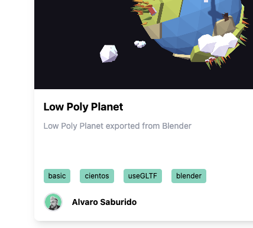

<p align="center">
  <a href="https://www.npmjs.com/package/@tresjs/core"></a>
  <a href="https://discord.gg/UCr96AQmWn"></a>
</p>
<br/>

# TresJS Lab

> Showcase and examples lab for TresJS

Live at [Lab](https://lab.tresjs.org/)

## Setup

Make sure to install the dependencies:

```bash
# yarn
yarn install

# npm
npm install

# pnpm
pnpm install
```

## Development Server

Start the development server on http://localhost:3000

```bash
npm run dev
```

## Production

Build the application for production:

```bash
npm run build
```

Locally preview production build:

```bash
npm run preview
```

Check out the [deployment documentation](https://nuxt.com/docs/getting-started/deployment) for more information.

## Add an experiment 🧪

You can easily add new TresJS examples into the playground by creating a branch from `main` with the following structure `feature/name-of-your-demo`.

This playground uses [nuxt/content](https://content.nuxtjs.org/)

### Add yourself as an author

First, add yourself as an author so your name figures on the demos you create



1. Create a `your-name.md` file under `content/authors` directory.
2. Add [Frontmatter](https://content.nuxtjs.org/guide/writing/markdown#front-matter) to provide your meta-data

```md
---
name: Alvaro Saburido
slug: alvarosabu
email: hola@alvarosaburido.dev
twitter: alvarosabu
github: alvarosabu
website: https://alvarosaburido.dev
avatar: https://avatars.githubusercontent.com/u/4699008?s=96&v=4
---
```

### Add a demo

Every demo or experiment consist on two parts

- A markdown file under `content/experiments/`
- A vue component containing the scene under `components/content`

1. Create a `your-awesome-demo.md` file under `content/experiments` directory.
2. Add [Frontmatter](https://content.nuxtjs.org/guide/writing/markdown#front-matter) to provide the meta-data of your experiment, this is crucial to get the cards on the home page nice and pretty. Remember to add the `slug` of your `author` to the correspondant field.

```md
---
thumbnail: /lowpoly-planet.png
title: Low Poly Planet
slug: lowpoly-planet
author: alvarosabu
description: Low Poly Planet exported from Blender
tags: ['basic', 'cientos', 'useGLTF', 'blender']
---
```

3. Create a component under `components/content` to hold your scene. If your scene contains `async features`, you can create it like this and Nuxt will auto-import it.

```
└── components/content/
    └── lowpoly-planet/
        ├── index.vue // This will be the `root` cmponent containing the `TresCanvas`
        └── model.vue // Component with async operation
```

4. Add it to the file created on steps **1** and .

```md
---
thumbnail: /lowpoly-planet.png
title: Low Poly Planet
slug: lowpoly-planet
author: alvarosabu
description: Low Poly Planet exported from Blender
tags: ['basic', 'cientos', 'useGLTF', 'blender']
---

<LowpolyPlanet />
```

5. Take a screenshot of your scene ot the `public` directory.

### Broken Github demo links

Note that the system will automatically add a link to your demo's source code on Github, so that visitors can see how you made your demo. 

The link will be broken until your demo is merged into the main Lab branch.

## License

[MIT](/LICENSE)

## Sponsors

Be the first to support this project [here](https://github.com/sponsors/alvarosabu) ☺️
