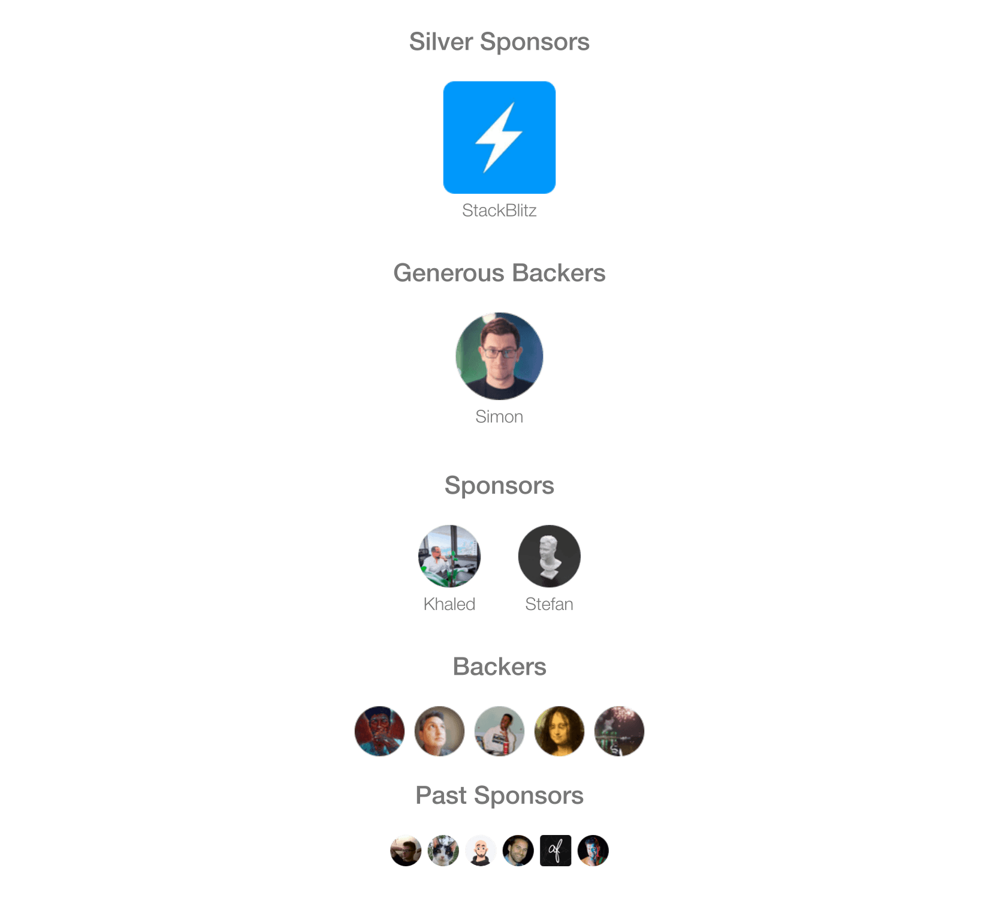

  
  
  
  

# TresJS Ecosystem

> Declarative ThreeJS using Vue Components

- 💡 Build 3D scene as they were Vue components
- 🥰 It brings all the updated features of ThreeJS right away regardless the version
- 🦾 Fully Typed

Tres (Spanish word for "three", pronounced `/tres/` ) is a way of creating ThreeJS scenes with Vue components in a declarative fashion.

It's build on-top of a [Vue Custom Renderer](https://vuejs.org/api/custom-renderer.html#createrenderer) and it's powered by Vite.

The goal is to provide the Vue's community an easy way of building 3D scenes with Vue, always up to date with the latest ThreeJS features and with 0-to-none maintenance.

## Start by

- Checking out the [docs](https://docs.tresjs.org)
- Consulting the [installation guide](https://docs.tresjs.org/getting-started/installation)
- Looking at some [demos](https://stackblitz.com/@alvarosabu/collections/tresjs)

## Ecosystem

| Package                                                      | Version                                                                                                            | Downloads                                                                                        |
| ------------------------------------------------------------ | :----------------------------------------------------------------------------------------------------------------- | ------------------------------------------------------------------------------------------------ |
| [Tres](https://github.com/TresJS/tres/packages/core)                     |                     |                     |
| [Cientos](https://github.com/TresJS/packages/cientos)                |               |               |
| [Post-processing](https://github.com/TresJS/packages/postprocessing) |  |  |
| [Nuxt](https://github.com/TresJS/packages/nuxt)                      |           |           |
| [TresLeches 🍰](https://github.com/TresJS/packages/leches)           |                |                |

## Sponsors

  

## Contribution

We are open to contributions, please make sure to read the [contributing guide](/CONTRIBUTING.md) before making a pull request.

## License

[MIT](/LICENSE)